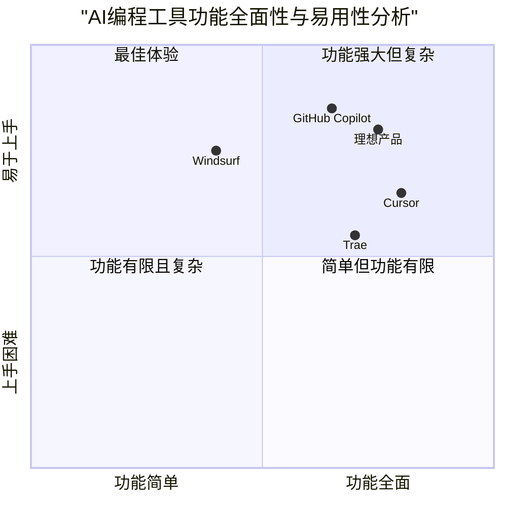

# AI编程工具对比网站产品需求文档 (PRD)

## 项目摘要

**项目名称**: ai_tools_comparison_website

**原始需求**: 创建一个对比Cursor、Windsurf、Trae和GitHub Copilot这四款AI编程工具的炫酷网站

**描述**: 基于收集的数据，打造一个视觉炫酷、内容全面、用户友好的网站，帮助开发者选择最适合自己的AI编程工具。

## 1. 产品定义

### 1.1 产品目标

1. 为开发者提供全面、客观的AI编程工具比较，帮助他们快速选择最适合自己需求的工具
2. 通过炫酷的视觉设计和交互体验，展示各AI编程工具的功能差异和实际应用场景
3. 建立一个权威的AI编程工具评测平台，吸引开发者社区参与讨论和分享使用经验

### 1.2 用户故事

1. 作为一名前端开发者，我想了解各AI编程工具在JavaScript和React开发中的表现差异，以便选择最适合我工作流程的工具
2. 作为一名刚接触AI编程工具的新手，我想通过直观的对比了解不同工具的学习曲线和入门门槛，以便选择最容易上手的工具
3. 作为一个开发团队的技术负责人，我想全面了解各工具的企业级功能和团队协作特性，以便为团队选择最合适的AI编程助手
4. 作为一名资源受限的独立开发者，我想了解各工具的性能消耗和价格策略，以便在预算有限的情况下做出最佳选择
5. 作为一名关注数据隐私的开发者，我想了解各工具的数据处理政策和隐私保护措施，以便选择最符合我安全需求的工具

### 1.3 竞品分析

已对以下四款AI编程工具进行深入分析：

1. **Cursor AI**
   - 优势: 强大的上下文感知能力、多行编辑、与VS Code相似的界面、代码库聊天功能
   - 劣势: Linux上的稳定性问题、隐私顾虑、复杂多文件架构支持有限

2. **Windsurf AI**
   - 优势: 轻量级设计、多IDE兼容性、智能代码补全、自由计划使开发者易于接触
   - 劣势: 调试功能相对弱、集成少于竞品、编程语言支持有限

3. **Trae (The Real AI Engineer)**
   - 优势: 目前免费提供优质AI模型、独特的思考后执行方法、多模态输入支持
   - 劣势: 缺乏网络访问功能、数据隐私顾虑、产品仍处于测试阶段

4. **GitHub Copilot**
   - 优势: 提高开发效率、自然集成入开发流程、适合学习新语言和框架
   - 劣势: 复杂任务表现不一、有一定学习曲线、隐私顾虑

### 1.4 竞争力象限分析



## 2. 技术规格

### 2.1 需求分析

创建一个对比四款AI编程工具的网站需要满足以下技术需求：

1. 响应式设计，确保在不同设备上都能提供良好的用户体验
2. 高度交互性的界面，能够动态展示各工具的对比数据
3. 视觉炫酷的UI设计，利用现代前端技术实现吸引人的动效
4. 清晰的数据可视化，让用户快速理解各工具的优劣势
5. 模块化的架构，便于未来添加更多AI工具进行比较
6. 高性能的页面加载速度，确保良好的用户体验
7. 搜索和过滤功能，帮助用户快速找到关注的对比点

### 2.2 需求池

#### P0（必须实现）

1. 四款AI编程工具的核心功能对比表格/图表
2. 各工具优缺点的详细展示
3. 价格策略对比
4. 适用场景和目标用户群体分析
5. 基于不同维度的工具对比可视化图表
6. 响应式设计，支持桌面和移动设备
7. 炫酷的视觉设计和交互效果

#### P1（应该实现）

1. 用户评价和市场反馈汇总
2. 基于不同用户角色的工具推荐功能
3. 互动式对比工具，可自定义对比维度
4. 技术指标的详细解释和重要性说明
5. 工具筛选和搜索功能
6. 暗黑模式支持
7. 各工具最新动态和更新信息

#### P2（可以实现）

1. 用户评分和评论系统
2. 工具使用案例和成功故事展示
3. 专家点评和深度分析文章
4. 订阅功能，接收工具更新通知
5. 社区互动功能，如问答板块
6. 个性化工具推荐算法
7. 多语言支持

### 2.3 UI设计草图

以下是主要页面的设计构思：

#### 主页
- 炫酷的动态背景，可能使用粒子效果或渐变动画
- 四款工具的标志和简要介绍，使用悬浮卡片样式
- 醒目的「开始对比」按钮引导用户深入
- 用户角色选择区，根据角色提供个性化内容

#### 对比页面
- 动态切换的对比视图（表格、雷达图、条形图等）
- 悬浮效果展示详细信息
- 可拖拽排序的功能列表
- 突出显示的优缺点标记

#### 工具详情页
- 沉浸式头图，展示工具界面
- 动态滚动时的视差效果
- 特性展示区使用交互式卡片
- 用户评价区采用轮播展示

#### 决策助手页面
- 交互式问卷界面，动态填充和进度展示
- 结果页使用动画过渡效果
- 推荐结果使用醒目的视觉呈现

### 2.4 开放问题

1. 如何确保网站内容与各工具的最新更新保持同步？
2. 是否需要与各工具官方建立合作，获取更详细的API和功能信息？
3. 如何平衡视觉炫酷效果与页面加载性能？
4. 网站是否需要实现多语言支持？
5. 数据可视化的最佳实现方式是什么？需要使用哪些图表库？
6. 如何衡量网站的成功与否？需要定义哪些关键性能指标？

## 3. 页面结构与导航设计

### 3.1 网站地图

```
首页
├── 工具对比
│   ├── 功能对比
│   ├── 价格对比
│   ├── 性能对比
│   └── 用户群体对比
├── 工具详情
│   ├── Cursor详情
│   ├── Windsurf详情
│   ├── Trae详情
│   └── GitHub Copilot详情
├── 决策助手
│   ├── 问卷调查
│   └── 个性化推荐
├── 资源中心
│   ├── 教程
│   ├── 使用技巧
│   └── 案例分析
└── 关于我们
```

### 3.2 导航结构

- **主导航**：固定在页面顶部，包含主要板块入口
- **内页导航**：使用侧边栏或标签页形式，方便在同一主题下切换内容
- **面包屑导航**：帮助用户了解当前位置和返回路径
- **快速跳转**：在长页面中提供快速定位到各节的按钮

### 3.3 页面组织

#### 首页
1. 醒目的英雄区(Hero Section)展示网站主题
2. 四款工具简介卡片，悬停效果显示核心优势
3. 交互式对比预览，吸引用户点击深入
4. 用户角色选择区，提供个性化入口
5. 最新动态和资讯板块

#### 工具对比页
1. 对比维度选择器
2. 可视化对比图表区域
3. 详细对比表格
4. 适用场景分析
5. 用户投票和反馈区

#### 工具详情页
1. 工具概述和主要特点
2. 技术实现和架构分析
3. 优缺点详解
4. 价格计划说明
5. 用户评价汇总
6. 使用技巧和教程

#### 决策助手页
1. 需求问卷
2. 实时结果更新
3. 个性化推荐结果
4. 推荐理由说明

## 4. 用户交互流程

### 4.1 核心用户旅程

#### 旅程1：特定功能对比
1. 用户访问首页
2. 点击「工具对比」进入对比页面
3. 选择「功能对比」标签
4. 筛选感兴趣的特定功能（如「代码补全」）
5. 查看四款工具在该功能上的详细对比
6. 点击某工具了解更多详情
7. 做出选择决定

#### 旅程2：基于用户角色的工具选择
1. 用户访问首页
2. 在用户角色区选择自己的角色（如「团队技术领导」）
3. 系统展示针对该角色的工具对比重点
4. 用户浏览特定对比内容
5. 使用决策助手进一步确认选择
6. 查看推荐工具的详细信息
7. 做出选择决定

#### 旅程3：价格和性能评估
1. 用户访问首页
2. 导航至「价格对比」页面
3. 查看各工具的价格结构对比
4. 导航至「性能对比」页面
5. 了解各工具的系统资源需求
6. 根据预算和硬件条件筛选合适的工具
7. 做出选择决定

### 4.2 交互设计要点

1. **实时响应**：用户操作后立即有视觉反馈
2. **平滑过渡**：页面间切换使用流畅的动画效果
3. **渐进式信息**：先展示重要信息，详细内容通过交互逐步呈现
4. **上下文帮助**：关键术语和指标旁提供解释性提示
5. **状态保留**：用户返回时保持之前的筛选和选择状态
6. **交互一致性**：整站保持一致的交互模式和反馈机制

## 5. UI/UX设计要点

### 5.1 视觉设计方向

#### 整体风格
- **科技感**：使用几何线条、渐变和微妙的光效
- **未来感**：设计元素呈现未来科技的视觉表征
- **专业性**：保持清晰的信息层次和专业的数据呈现
- **动感**：适当的动画和转场效果增强用户体验

#### 配色方案
- **主色调**：深蓝色和紫色渐变，传达技术和创新
- **辅助色**：每个工具分配独特的标识色（Cursor-蓝色，Windsurf-绿色，Trae-紫色，GitHub Copilot-黄色）
- **强调色**：明亮的青色用于高亮重要信息和交互元素
- **背景**：深色背景搭配霓虹效果，增强未来感和科技感

#### 字体选择
- 标题：几何无衬线字体，如Eurostile或Audiowide
- 正文：清晰易读的无衬线字体，如Roboto或Inter
- 代码示例：等宽字体，如JetBrains Mono或Fira Code

### 5.2 动效设计

#### 页面过渡
- 使用平滑的页面转换动画
- 内容块进入视口时的渐显效果
- 3D透视效果增强空间感

#### 交互反馈
- 按钮点击时的脉冲效果
- 卡片悬停时的微妙上浮和阴影变化
- 滚动触发的视差效果

#### 特效元素
- 背景中的粒子流动效果
- 数据可视化的动态生成过程
- 工具Logo的微妙动画
- 代码块的打字机效果

### 5.3 响应式设计考量

- **移动优先**：确保在小屏设备上的良好体验
- **模块重排**：根据屏幕尺寸智能调整内容布局
- **触控友好**：为移动用户提供足够大的交互目标
- **性能优化**：在移动设备上适当减少复杂动画效果
- **关键内容优先**：确保最重要的信息不受屏幕尺寸限制

## 6. 内容展示策略

### 6.1 工具比较方法

#### 表格对比
- 功能清单对比表，使用图标标记支持状态
- 价格计划对比表，突出最具性价比的选项
- 技术规格对比，使用刻度条直观展示性能差异

#### 可视化对比
- 雷达图展示各工具在不同维度的综合表现
- 柱状图比较具体指标数据
- 四象限图定位各工具的市场定位

#### 特性详解
- 各工具独特功能的深入解析
- 案例演示，展示实际应用场景
- 优缺点分析，使用对比色标记

### 6.2 优缺点突出展示

#### 视觉编码
- 使用绿色和红色分别标记优点和缺点
- 优点使用"+"图标，缺点使用"-"图标
- 通过卡片大小和位置强调重要优缺点

#### 比较策略
- 同类特性直接对照展示
- 提供竞争力得分，量化各维度表现
- 使用用户案例故事说明优缺点在实际工作中的影响

#### 交互式探索
- 允许用户根据自己关注的维度筛选和排序优缺点
- 提供深度/简洁模式切换，满足不同用户的信息需求
- 鼓励用户投票评选最重要的优缺点

### 6.3 用户情境匹配

- 基于用户角色推荐最适合的工具
- 提供场景化的使用案例，如"团队协作"、"初学者学习"等
- 决策树引导用户根据自身需求找到最佳工具

## 7. 技术需求和实现建议

### 7.1 前端技术栈

- **框架**: React.js，利用组件化开发提高复用性和维护性
- **样式**: Tailwind CSS，实现快速开发和一致的设计系统
- **状态管理**: Redux或Context API，管理全局状态和用户选择
- **动画**: Framer Motion或GSAP，实现流畅的页面动效
- **数据可视化**: D3.js或Chart.js，创建交互式图表和数据展示

### 7.2 后端考虑

- 静态生成为主，可使用Next.js进行SSG/SSR优化
- API路由用于处理动态内容（如用户反馈、投票）
- 轻量级后端服务，主要提供数据更新和用户互动功能

### 7.3 性能优化

- 代码分割和懒加载，优化初始加载速度
- 图片优化，使用WebP格式和响应式图片技术
- 资源预加载，提升页面转换体验
- 动画性能优化，使用GPU加速和requestAnimationFrame

### 7.4 部署与托管

- 推荐使用Vercel或Netlify进行静态网站托管
- 使用CDN加速全球访问速度
- 实现CI/CD流程，确保内容更新的快速发布

### 7.5 SEO和可访问性

- 语义化HTML结构，提升搜索引擎理解
- 优化元数据和结构化数据
- 遵循WCAG标准，确保无障碍访问
- 关键字优化，增强在搜索结果中的可见性

### 7.6 扩展性考虑

- 模块化数据结构，便于添加新的AI编程工具
- 可配置的对比框架，支持自定义对比维度
- API化的内容管理，支持后续开发内容管理系统

## 8. 实施计划

### 8.1 开发阶段

1. **设计阶段** (2周)
   - UI/UX设计
   - 交互原型制作
   - 设计系统建立

2. **前端开发** (4周)
   - 基础框架搭建
   - 页面组件开发
   - 动效实现

3. **内容整合** (2周)
   - 数据结构化
   - 内容编写和整理
   - 可视化图表创建

4. **测试和优化** (2周)
   - 功能测试
   - 性能优化
   - 跨浏览器兼容性测试

5. **发布和迭代** (持续)
   - 初始发布
   - 数据更新机制建立
   - 基于用户反馈的迭代


## 9. 成功指标

### 9.1 用户参与度指标

- 网站访问量
- 平均会话时长
- 页面浏览深度
- 功能使用率（对比工具、决策助手等）
- 跳出率

### 9.2 转化指标

- 工具链接点击率
- 工具推荐生成次数
- 分享率
- 回访率

### 9.3 内容有效性

- 用户满意度调查
- 内容正确性反馈
- 提供的信息是否帮助用户做出决策

## 10. 总结

本PRD详细规划了一个面向开发者的AI编程工具对比网站，旨在通过炫酷的视觉设计和全面的内容，帮助用户选择最适合自己需求的AI编程助手。网站将重点突出Cursor、Windsurf、Trae和GitHub Copilot四款工具的核心特性、优缺点、适用场景和价格策略，并提供个性化的工具推荐。

通过响应式设计、交互式对比和可视化图表，网站将为用户提供直观、高效的决策支持。产品定位为专业开发者的权威参考资源，同时兼顾教育和指导初学者的功能。
